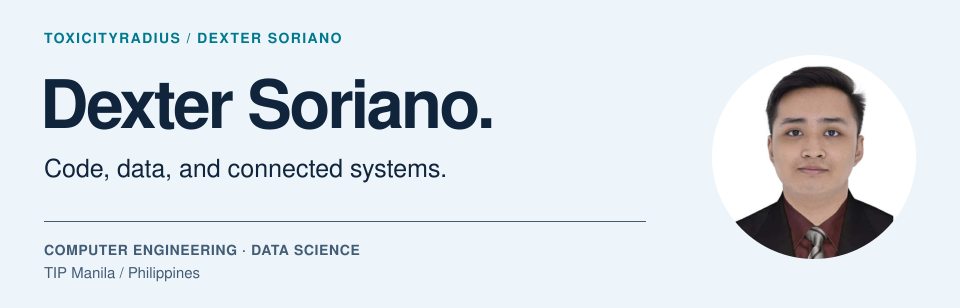

<picture>
  <source media="(max-width: 600px) and (prefers-color-scheme: dark)" srcset="./assets/hero-dark-mobile.svg">
  <source media="(max-width: 600px)" srcset="./assets/hero-light-mobile.svg">
  <source media="(prefers-color-scheme: dark)" srcset="./dark.svg">
  
</picture>

I'm a **Computer Engineering student at TIP Manila, majoring in Data Science**. I build developer tools, web interfaces, and connected hardware projects.

[**View my portfolio ↗**](https://toxicityradius.github.io/) &nbsp; · &nbsp; [**Connect on LinkedIn ↗**](https://www.linkedin.com/in/dexter-aic-soriano-382063335/)

## Selected work

### [FormProof](https://github.com/ToxicityRadius/FormProof)

A CLI for inspecting web accessibility issues and checking proposed repairs with before-and-after browser evidence. I built the inspection and repair workflow, source adapters, and regression checks.

TypeScript · Playwright · axe-core · Developer tooling

### [BantayBayan](https://github.com/ToxicityRadius/IoT-Competition)

A climate monitoring and control prototype connecting an Arduino sensor node to a Flask dashboard. My work connects the firmware, sensor uploads, and acknowledged LED and buzzer commands.

Arduino · ESP8266 · Python · Flask · SQLite

### [Personal portfolio](https://github.com/ToxicityRadius/toxicityradius.github.io)

A responsive home for my computer vision, data, and web projects. I designed and built the interface, project presentation, and interactions.

HTML · CSS · JavaScript · Responsive design

## On GitHub

A closer look at my public work. Each graphic carries its own update date; language usage describes repository contents, not proficiency.

  
  

  
  

  

Generated graphics powered by [Metrics](https://github.com/lowlighter/metrics). [Profile maintenance](./docs/PROFILE.md).
